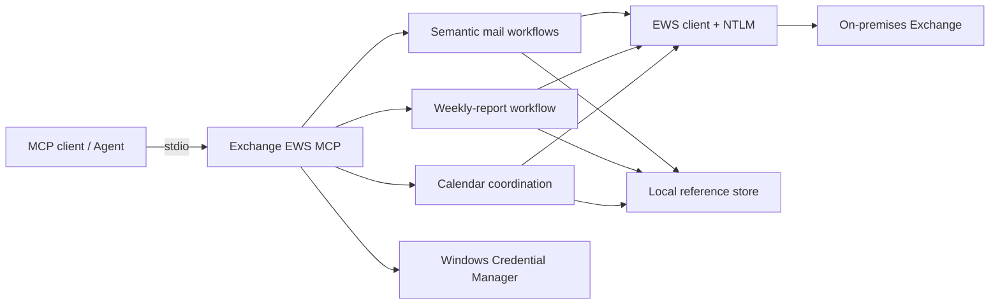

# Exchange EWS MCP v0.6.14

**English** | [简体中文](README.zh-CN.md)

[](https://github.com/ShermanGu/exchange-ews-mcp/actions/workflows/ci.yml)
[](https://www.python.org/)
[](https://www.microsoft.com/windows/)
[](LICENSE)

A local, draft-first [Model Context Protocol (MCP)](https://modelcontextprotocol.io/) server for on-premises Microsoft Exchange. It connects through EWS + NTLM, keeps credentials in Windows Credential Manager, and exposes focused mail, weekly-report, and calendar workflows to MCP clients over stdio.

> [!IMPORTANT]
> This project targets on-premises Exchange environments that expose EWS with NTLM. It is not an OAuth client for Exchange Online or Microsoft Graph.

## Highlights

- **Local by design** — the MCP server runs on the user's Windows machine; no relay service is required.
- **Draft-first mail safety** — compose, reply, forward, and weekly-report tools create unsent drafts.
- **Explicit meeting sends** — invitations require a separate confirmation step.
- **Curated Agent surface** — 19 production tools; 6 additional low-level tools are debug-only.
- **Opaque local references** — Agents use `message_ref`, `draft_ref`, `calendar_ref`, and one-time workflow tokens rather than raw Exchange IDs.
- **Weekly-report intelligence without HTML generation** — the Agent sees compact text slots and location strings; the server keeps and validates the original HTML.
- **Complex layout support** — weekly-report locations cover merged cells, multi-level headers, nested tables, paragraphs, headings, and lists.
- **Full date review** — the weekly-report prompt requires all inherited reporting-period dates to be checked before a draft is created.

## Safety model

| Boundary | Behavior |
| --- | --- |
| Credentials | Passwords are stored in Windows Credential Manager, not in project files or MCP responses. |
| Mail writes | Compose, reply, forward, and weekly-report workflows create drafts and never send automatically. |
| Meeting invitations | Sending requires an explicit confirmation action. |
| Exchange identifiers | Item IDs and change keys remain behind expiring local references. |
| Ambiguous matches | The server returns candidates and a resumable confirmation token. |
| Weekly-report HTML | The Agent never receives or regenerates the HTML template; only text slots are editable. |
| Weekly workflow order | A random, 30-minute, single-use token enforces `get_weekly_report_context` before `update_weekly_report`. |
| Attachments | Local paths are constrained to configured roots and validated before remote state is created. |

These controls reduce risk, but they do not replace Exchange permissions, administrator policy, endpoint security, MCP-client controls, or user review.

## Architecture



See [ARCHITECTURE.md](docs/ARCHITECTURE.md) for component boundaries and [WEEKLY-REPORT.md](docs/WEEKLY-REPORT.md) for the weekly-report data flow.

## Requirements

- Windows 10/11 or Windows Server
- Python 3.10–3.13
- A reachable Exchange EWS endpoint
- An Exchange account allowed to use EWS with NTLM
- An MCP client that supports local stdio servers

## Quick start

### 1. Clone and install

```powershell
git clone https://github.com/ShermanGu/exchange-ews-mcp.git
cd exchange-ews-mcp
.\install.cmd
```

The installer creates `.venv`, installs dependencies, force-reinstalls the local source, and verifies both module and distribution versions.

### 2. Configure Exchange

```powershell
.\.venv\Scripts\exchange-ews-mcp.exe configure
.\.venv\Scripts\exchange-ews-mcp.exe set-current-user `
  --email "you@company.example" `
  --display-name "Your Name"
.\.venv\Scripts\exchange-ews-mcp.exe status
.\.venv\Scripts\exchange-ews-mcp.exe test
```

`configure` prompts for the EWS URL, username, and password. The password is written to Windows Credential Manager.

### 3. Configure calendar preferences

```powershell
.\.venv\Scripts\exchange-ews-mcp.exe set-calendar-preferences `
  --time-zone "Asia/Shanghai" `
  --workday-start "09:00" `
  --workday-end "18:00" `
  --slot-minutes 30
```

The EWS layer keeps UTC semantics. Agent-facing results include local display fields where appropriate.

### 4. Generate MCP configuration

```powershell
.\.venv\Scripts\exchange-ews-mcp.exe mcp-config
```

Equivalent production configuration:

```json
{
  "mcpServers": {
    "exchange-ews": {
      "command": "D:\\tools\\exchange-ews-mcp\\.venv\\Scripts\\python.exe",
      "args": ["-m", "exchange_ews_mcp.server"]
    }
  }
}
```

Restart the MCP client after changing its configuration. Use the production server for normal operation; reserve `exchange_ews_mcp.debug_server` for protocol troubleshooting.

### 5. Verify the installation

```powershell
.\.venv\Scripts\exchange-ews-mcp.exe version
.\.venv\Scripts\exchange-ews-mcp.exe tool-list
```

Expected release version: `0.6.14`. Expected production tool count: `19`.

## Production tools

| Area | Tools |
| --- | --- |
| Identity and mail reads | `get_current_user`, `list_emails`, `search_emails`, `get_email`, `find_email`, `resolve_people` |
| Draft workflows | `compose_email`, `reply_to_email`, `forward_email`, `update_email_draft`, `add_attachment_to_draft`, `continue_action` |
| Weekly reports | `get_weekly_report_context`, `update_weekly_report` |
| Calendar | `get_user_availability`, `list_calendar_events`, `get_calendar_item`, `find_meeting_times`, `schedule_meeting` |

The debug profile adds `resolve_names`, `create_draft`, `reply_as_draft`, `forward_as_draft`, `update_draft`, and `create_meeting`.

See [AGENT-TOOLS.md](docs/AGENT-TOOLS.md) for routing rules and [AGENT-CONNECTION.md](docs/AGENT-CONNECTION.md) for connection examples.

## Weekly-report workflow

The weekly-report workflow is deliberately two-step:

```text
User's short progress update
        ↓
get_weekly_report_context
  - reads up to five weekly-report sections
  - extracts editable text slots
  - returns slot_id + text + compact location
  - returns a single-use weekly_flow_token
        ↓
Agent compares history, rewrites facts in formal report language,
and selects only changed slots
        ↓
update_weekly_report
  - atomically consumes the token
  - inserts escaped text into the original HTML template
  - verifies the HTML structure is unchanged
  - creates one native Reply All draft
```

The Agent never receives the HTML template and only submits:

```json
{
  "weekly_flow_token": "weeklyflow_xxx",
  "changes": [
    {
      "slot_id": "slot_0019_xxx",
      "new_text": "Completed interface integration testing."
    }
  ]
}
```

See [WEEKLY-REPORT.md](docs/WEEKLY-REPORT.md) for separator rules, token states, slot locations, date handling, and format limitations.

## Development and tests

```powershell
py -3 -m venv .venv
.\.venv\Scripts\python.exe -m pip install -e ".[dev]"
.\run-release-check.cmd
```

`run-release-check.cmd` first uses the `python` command from the current shell when that interpreter can import pytest. It falls back to a pytest-enabled project virtual environment or the Windows `py -3` launcher. Distribution builds deliberately use that same interpreter with build isolation disabled, which avoids temporary-backend failures on corporate or offline package indexes. The selected interpreter must have `setuptools`, `wheel`, and optionally `build`; installing `.[dev]` provides the complete release-check environment.

The repository CI runs the strict suite on Python 3.10, 3.11, 3.12, and 3.13, then builds and installs the wheel in a clean environment.

Live Exchange development tests are separate because they require user-owned mailbox configuration. See [DT.md](docs/DT.md).

## Documentation

| Document | Purpose |
| --- | --- |
| [README.zh-CN.md](README.zh-CN.md) | Simplified Chinese project overview. |
| [AGENT-CONNECTION.md](docs/AGENT-CONNECTION.md) | Connect an MCP client and verify the production profile. |
| [AGENT-TOOLS.md](docs/AGENT-TOOLS.md) | Tool inventory and Agent routing rules. |
| [ARCHITECTURE.md](docs/ARCHITECTURE.md) | Component boundaries and safety properties. |
| [WEEKLY-REPORT.md](docs/WEEKLY-REPORT.md) | Weekly-report extraction, layout, prompt, and update contract. |
| [DT.md](docs/DT.md) | Live Exchange development-test guide. |
| [FRESH-START.md](docs/FRESH-START.md) | Clean installation and upgrade checklist. |
| [CHANGELOG.md](docs/CHANGELOG.md) | Release history. |
| [RELEASE-AUDIT.md](docs/RELEASE-AUDIT.md) | Exact v0.6.14 validation record and artifact hashes. |
| [RELEASE-CHECKLIST.md](docs/RELEASE-CHECKLIST.md) | Reusable release gate and live-DT checklist. |
| [CONTRIBUTING.md](docs/CONTRIBUTING.md) | Development and pull-request guide. |
| [SECURITY.md](docs/SECURITY.md) | Private vulnerability-reporting policy. |

## Limitations

- Windows is the primary runtime target because credentials use Windows Credential Manager and authentication uses NTLM.
- EWS behavior depends on Exchange version, mailbox policy, and server configuration.
- The weekly-report workflow currently requires EWS to return an HTML body and a recognized `WordSection1` reply-history boundary. Plain-text bodies are rejected rather than edited unsafely.
- RTF messages may be converted to HTML by Exchange; exact Outlook/Exchange output can vary by environment.
- The weekly-report workflow updates existing text slots only. It does not create or delete table rows or other HTML structures.
- This project does not bypass mailbox permissions or organizational controls.
- Exchange Online tenants should generally prefer Microsoft Graph and modern authentication.

## Contributing and security

Contributions are welcome. Start with [CONTRIBUTING.md](docs/CONTRIBUTING.md) or [CONTRIBUTING.zh-CN.md](docs/CONTRIBUTING.zh-CN.md).

Do not disclose vulnerabilities in public issues. Follow [SECURITY.md](docs/SECURITY.md) or [SECURITY.zh-CN.md](docs/SECURITY.zh-CN.md).

## License

Released under the [MIT License](LICENSE).
