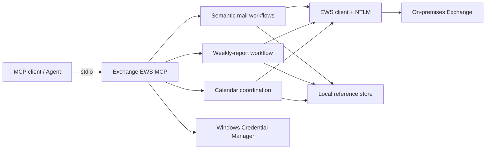

# Exchange EWS MCP v0.7.0

**English** | [简体中文](README.zh-CN.md)

[](https://github.com/ShermanGu/exchange-ews-mcp/actions/workflows/ci.yml)
[](https://www.python.org/)
[](https://www.microsoft.com/windows/)
[](LICENSE)

📮 **Give your on-premises Exchange an AI assistant.**

Tired of copying last week's report? Digging through old mail before every reply? Checking calendars one person at a time just to book a meeting?

**Exchange EWS MCP** connects an MCP Agent to Microsoft Exchange through **EWS + NTLM**. The Agent can search mail, prepare drafts, update weekly reports, check availability, and manage meetings — while important sends stay under user control.

> [!IMPORTANT]
> Designed for **on-premises Exchange with EWS + NTLM**. It is not an Exchange Online / Microsoft Graph OAuth client.

## ✨ Highlights

- 📧 Search mail, compose drafts, reply, forward, edit drafts, add attachments.
- 👥 Resolve recipients from full pinyin names or complete email addresses.
- 📝 Update weekly reports while preserving the original Outlook HTML layout.
- 📅 Check availability, find common time, create/edit meetings, and send invitations after confirmation.
- 🔐 Store passwords in Windows Credential Manager.
- 🛡️ Draft-first workflows keep the final send under user control.

## 🧭 Architecture



The server runs locally on Windows and exposes higher-level mail and calendar workflows to the Agent. Exchange credentials and low-level Exchange IDs stay behind the server.

---

# 🚀 Quick start

**Clone → install → connect Exchange → paste one server path into your MCP client.**

## 1. Requirements

- Windows 10/11 or Windows Server
- Python 3.10–3.13
- Access to your Exchange EWS endpoint
- An Exchange account allowed to use EWS with NTLM

## 2. Install

```powershell
git clone https://github.com/ShermanGu/exchange-ews-mcp.git
cd exchange-ews-mcp
.\install.cmd
```

The installer creates `.venv` and installs everything locally.

## 3. Configure Exchange

```powershell
.\.venv\Scripts\exchange-ews-mcp.exe configure
```

Set the current mailbox user:

```powershell
.\.venv\Scripts\exchange-ews-mcp.exe set-current-user `
  --email "you@company.example" `
  --display-name "Your Name"
```

Check the connection:

```powershell
.\.venv\Scripts\exchange-ews-mcp.exe status
.\.venv\Scripts\exchange-ews-mcp.exe test
```

Your password is stored in **Windows Credential Manager**, not in the repository.

## 4. Set calendar preferences

```powershell
.\.venv\Scripts\exchange-ews-mcp.exe set-calendar-preferences `
  --time-zone "Asia/Shanghai" `
  --workday-start "09:00" `
  --workday-end "18:00" `
  --slot-minutes 30
```

## 5. Connect your MCP client

### ✅ Recommended: point directly to the EXE

After installation, the production MCP server is:

```text
<repo>\.venv\Scripts\exchange-ews-mcp-server.exe
```

If your MCP client has **Command** and **Arguments** fields:

```text
Command:
D:\tools\exchange-ews-mcp\.venv\Scripts\exchange-ews-mcp-server.exe

Arguments:
<leave empty>
```

Use an **absolute path**, save the configuration, then restart the MCP client.

### Or use JSON

```json
{
  "mcpServers": {
    "exchange-ews": {
      "command": "D:\\tools\\exchange-ews-mcp\\.venv\\Scripts\\exchange-ews-mcp-server.exe"
    }
  }
}
```

You can also run:

```powershell
.\.venv\Scripts\exchange-ews-mcp.exe mcp-config
```

## 6. Verify

```powershell
.\.venv\Scripts\exchange-ews-mcp.exe version
.\.venv\Scripts\exchange-ews-mcp.exe tool-list
```

Expected version: `0.7.0` · Production tools: `11`

🎉 Done — your Agent can now work with Exchange.

## 💬 Try these prompts

```text
Find my latest weekly report and update it with this week's progress.
```

```text
Draft an email to wangxiaoming saying integration testing is complete. Don't send it.
```

```text
Find the earliest one-hour slot next week when lixiaohong and I are both free, create a meeting, and save it without sending.
```

## 🧰 Main capabilities

| Area | Capabilities |
| --- | --- |
| Mail | Search/read mail, compose drafts, reply, forward, edit drafts, attachments |
| People | Recipient resolution and ambiguity handling |
| Weekly reports | Read recent history and create an updated Reply All draft without rebuilding the HTML template |
| Calendar | Availability, common slots, calendar reads, create/update meetings, send invitations |

The compact mail facade uses `search_mail`, `read_mail`, `save_mail_draft`, and `edit_mail_draft`. Weekly reports keep the mandatory `get_weekly_report_context` → `update_weekly_report` sequence. Calendar creation/editing uses `save_meeting`; confirmed sending uses `send_meeting_invitation`.

## 📝 Weekly reports

```text
Previous report
      ↓
Read recent history
      ↓
Agent decides what changed
      ↓
Update only relevant text
      ↓
Create a new Reply All draft
```

The Agent does **not** regenerate the whole HTML template. The server keeps the existing layout and updates approved text slots only.

## 🔒 Safety in short

- Mail is draft-first.
- Meeting sends require explicit confirmation.
- Credentials stay in Windows Credential Manager.
- Ambiguous recipients or meeting times are returned for confirmation instead of guessed.

## 📚 Documentation

[Agent connection](docs/AGENT-CONNECTION.md) · [Agent tools](docs/AGENT-TOOLS.md) · [Architecture](docs/ARCHITECTURE.md) · [Weekly reports](docs/WEEKLY-REPORT.md) · [Development tests](docs/DT.md) · [Changelog](docs/CHANGELOG.md)

For contributors: [CONTRIBUTING.md](docs/CONTRIBUTING.md) · [SECURITY.md](docs/SECURITY.md)

## Limitations

Windows is the primary runtime target. EWS behavior depends on Exchange version and mailbox policy. Weekly-report editing currently expects a supported Outlook/Word HTML reply structure. Exchange Online users should generally prefer Microsoft Graph and modern authentication.

## License

Released under the [MIT License](LICENSE).
