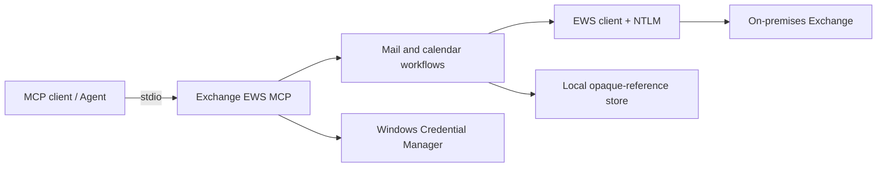

# Exchange EWS MCP

**English** | [简体中文](README.zh-CN.md)

[](https://github.com/ShermanGu/exchange-ews-mcp/actions/workflows/ci.yml)
[](https://www.python.org/)
[](https://www.microsoft.com/windows/)
[](LICENSE)

A local, draft-first [Model Context Protocol (MCP)](https://modelcontextprotocol.io/) server for on-premises Microsoft Exchange. It connects through EWS and NTLM, keeps credentials in Windows Credential Manager, and exposes focused mail and calendar tools to MCP clients over stdio.

> [!IMPORTANT]
> This project is designed for on-premises Exchange environments that expose EWS with NTLM. It is not an OAuth client for Exchange Online or Microsoft Graph.

## Why this project

- **Local by design** — the MCP server runs on the user's Windows machine; no relay service is required.
- **Draft-first safety** — mail-writing tools create drafts and never send automatically.
- **Explicit meeting sends** — invitations require an explicit confirmation path.
- **Focused tool surface** — 18 production tools cover identity, mail, templates, availability, and calendar workflows.
- **Opaque local references** — Agents work with `message_ref`, `draft_ref`, and `template_ref` instead of raw Exchange identifiers.
- **Conversation-aware templates** — EWS `UniqueBody` is preferred so quoted history is excluded before a reusable format is stored.
- **Server-side template rendering** — complete templates stay local; the Agent provides only new content when using `template_ref`.

## Safety model

Exchange EWS MCP intentionally places several boundaries between an Agent and Exchange:

| Boundary | Behavior |
| --- | --- |
| Credentials | Passwords are stored in Windows Credential Manager, not in project files or MCP responses. |
| Mail writes | Compose, reply, and forward workflows create unsent drafts. |
| Meeting invitations | Sending requires an explicit confirmation flag. |
| Exchange identifiers | Item IDs and change keys remain behind expiring local references. |
| Ambiguous matches | The server returns candidates and a resumable confirmation token. |
| Template HTML | Complete HTML stays in local state; large tool results contain compact previews only. |
| Attachments | Paths are constrained, and template resources are validated before a draft is created. |

These controls reduce risk, but they do not replace Exchange permissions, server policy, MCP client controls, or user review.

## Architecture



The production server exposes semantic workflows. A separate debug server adds six lower-level EWS write primitives for protocol troubleshooting.

## Requirements

- Windows 10/11 or Windows Server
- Python 3.10 or newer
- An on-premises Microsoft Exchange EWS endpoint reachable from the machine
- An Exchange account allowed to use EWS with NTLM
- An MCP client that supports local stdio servers

## Quick start

### 1. Clone and install

```powershell
git clone https://github.com/ShermanGu/exchange-ews-mcp.git
cd exchange-ews-mcp
.\install.cmd
```

The installer creates `.venv`, installs the package and dependencies, and verifies the installed package version.

### 2. Configure Exchange

```powershell
.\.venv\Scripts\exchange-ews-mcp.exe configure
.\.venv\Scripts\exchange-ews-mcp.exe set-current-user `
  --email "you@company.example" `
  --display-name "Your Name"
.\.venv\Scripts\exchange-ews-mcp.exe status
.\.venv\Scripts\exchange-ews-mcp.exe test
```

`configure` prompts for the EWS URL, username, and password. The password is written to Windows Credential Manager.

### 3. Generate MCP configuration

```powershell
.\.venv\Scripts\exchange-ews-mcp.exe mcp-config
```

Equivalent configuration:

```json
{
  "mcpServers": {
    "exchange-ews": {
      "command": "D:\\tools\\exchange-ews-mcp\\.venv\\Scripts\\python.exe",
      "args": ["-m", "exchange_ews_mcp.server"]
    }
  }
}
```

Restart the MCP client after changing its server configuration. Use the production server for normal operation; reserve `exchange_ews_mcp.debug_server` for troubleshooting.

### 4. Verify the local installation

```powershell
.\.venv\Scripts\exchange-ews-mcp.exe version
.\.venv\Scripts\exchange-ews-mcp.exe tool-list
```

## Production tools

| Area | Tools |
| --- | --- |
| Identity and mail reads | `get_current_user`, `list_emails`, `search_emails`, `get_email`, `find_email`, `resolve_people` |
| Draft workflows | `compose_email`, `extract_email_template`, `reply_to_email`, `forward_email`, `update_email_draft`, `add_attachment_to_draft`, `continue_action` |
| Calendar | `get_user_availability`, `list_calendar_events`, `get_calendar_item`, `find_meeting_times`, `schedule_meeting` |

See [AGENT-TOOLS.md](AGENT-TOOLS.md) for routing guidance and [AGENT-CONNECTION.md](AGENT-CONNECTION.md) for MCP client setup.

## Template workflow

Template extraction is read-only and independent from writing a new message or replying:

```text
extract_email_template
        ↓ template_ref + compact preview
Agent generates only the new content fragment
        ↓
compose_email or reply_to_email
        ↓
server renders against the complete local template
```

The single body-parameter contract is:

- Without `template_ref`, `body_html` is the complete HTML body.
- With `template_ref`, `body_html` is only the new content fragment.
- For replies, `message_ref` selects the conversation and recipients; `template_ref` independently selects formatting resources.

Example calls:

```text
extract_email_template(...) -> template_ref
compose_email(..., template_ref=template_ref, body_html="<p>New content</p>")
reply_to_email(message_ref=target, template_ref=template_ref, body_html="<p>New reply</p>")
```

Normal template attachments are not copied unless explicitly requested. Referenced inline `cid:` resources are copied after preflight validation.

## Command-line examples

Extract a template from Sent Items:

```powershell
.\.venv\Scripts\exchange-ews-mcp.exe extract-email-template `
  --folders "Sent Items" `
  --subject-contains "weekly report"
```

Create a templated draft:

```powershell
.\.venv\Scripts\exchange-ews-mcp.exe compose-email `
  --to "recipient@company.example" `
  --subject "Weekly project report" `
  --html-file ".\new-content.html" `
  --template-ref "tmpl_xxx"
```

## Development

```powershell
py -3 -m venv .venv
.\.venv\Scripts\python.exe -m pip install -e ".[test]"
.\.venv\Scripts\python.exe -m pytest -W error::ResourceWarning
```

The current regression suite contains 185 tests. GitHub Actions runs the strict suite on supported Python versions.

## Documentation

| Document | Purpose |
| --- | --- |
| [AGENT-CONNECTION.md](AGENT-CONNECTION.md) | Connect an MCP client and choose the production profile. |
| [AGENT-TOOLS.md](AGENT-TOOLS.md) | Tool inventory and Agent routing guidance. |
| [ARCHITECTURE.md](ARCHITECTURE.md) | Mail-template architecture and safety properties. |
| [TEMPLATE-EXTRACTION.md](TEMPLATE-EXTRACTION.md) | Extraction rules, `UniqueBody`, references, and resources. |
| [TEMPLATE-ARCHITECTURE.zh-CN.md](TEMPLATE-ARCHITECTURE.zh-CN.md) | Detailed template architecture in Simplified Chinese. |
| [CHANGELOG.md](CHANGELOG.md) | Release history. |
| [CONTRIBUTING.md](CONTRIBUTING.md) | Development and pull-request guide. |
| [SECURITY.md](SECURITY.md) | Private vulnerability reporting policy. |

## Limitations

- The primary runtime target is Windows because credentials use Windows Credential Manager and authentication uses NTLM.
- EWS behavior and availability depend on Exchange version, server configuration, and administrator policy.
- This project does not bypass mailbox permissions or organizational controls.
- Exchange Online tenants should generally prefer Microsoft Graph and modern authentication.

## Contributing and security

Contributions are welcome. Start with [CONTRIBUTING.md](CONTRIBUTING.md) or its [Simplified Chinese translation](CONTRIBUTING.zh-CN.md).

Please do not report vulnerabilities in public issues. Follow [SECURITY.md](SECURITY.md) or [SECURITY.zh-CN.md](SECURITY.zh-CN.md).

## License

Released under the [MIT License](LICENSE).
