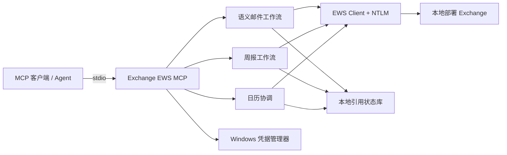

# Exchange EWS MCP v0.6.16

[English](README.md) | **简体中文**

[](https://github.com/ShermanGu/exchange-ews-mcp/actions/workflows/ci.yml)
[](https://www.python.org/)
[](https://www.microsoft.com/windows/)
[](LICENSE)

一个面向本地部署 Microsoft Exchange 的“草稿优先”[模型上下文协议（MCP）](https://modelcontextprotocol.io/)服务器。它通过 EWS + NTLM 连接 Exchange，把密码保存在 Windows 凭据管理器中，并通过 stdio 向 MCP 客户端提供邮件、周报和日历工作流。

> [!IMPORTANT]
> 本项目面向开放 EWS + NTLM 的本地部署 Exchange 环境，不是 Exchange Online 或 Microsoft Graph 的 OAuth 客户端。

## 主要能力

- **完全本地运行**：MCP Server 运行在用户 Windows 电脑上，不需要中转服务。
- **邮件草稿优先**：新建、回复、转发和周报更新只创建草稿，不自动发送。
- **会议发送需确认**：会议可以仅保存并继续修改；发送已保存会议邀请必须经过独立确认。
- **Agent 工具面清晰**：Production 提供 21 个工具；6 个底层写入工具仅在 Debug profile 中出现。
- **隐藏 Exchange 标识**：Agent 使用 `message_ref`、`draft_ref`、`calendar_ref` 和一次性流程 token，不直接处理 ItemId/ChangeKey。
- **周报不让模型生成 HTML**：Agent 只看到压缩后的文本槽位和位置字符串；完整 HTML 始终由 Server 保存、填充和校验。
- **复杂版面支持**：周报位置可描述合并单元格、多级表头、嵌套表格、标题、段落和列表。
- **日期硬校验**：周报 Prompt 强制检查所有继承的周报周期日期，避免只更新正文而漏改日期。

## 安全边界

| 边界 | 行为 |
| --- | --- |
| 凭据 | 密码保存到 Windows 凭据管理器，不进入项目文件或 MCP 返回值。 |
| 邮件写入 | 新建、回复、转发和周报流程只创建未发送草稿。 |
| 会议邀请 | 发送邀请需要显式二次确认。 |
| Exchange 标识 | ItemId 和 ChangeKey 保留在有时效的本地引用之后。 |
| 搜索歧义 | 返回候选项和可恢复确认令牌，不擅自选择。 |
| 周报 HTML | Agent 不读取、不生成 HTML 模板，只能修改服务端给出的文本槽位。 |
| 周报调用顺序 | 随机、30 分钟有效、只能使用一次的 token 强制执行 `get` 后再 `update`。 |
| 附件 | 文件路径必须位于配置的 allow-list 目录，并在远端写入前完成验证。 |

这些边界用于降低风险，但不能替代 Exchange 权限、管理员策略、终端安全、MCP 客户端控制和用户审核。

## 架构



组件边界见 [ARCHITECTURE.md](docs/ARCHITECTURE.md)，周报详细流程见 [WEEKLY-REPORT.md](docs/WEEKLY-REPORT.md)。

## 环境要求

- Windows 10/11 或 Windows Server
- Python 3.10–3.13
- 本机能够访问 Exchange EWS 地址
- Exchange 账号允许通过 NTLM 使用 EWS
- 支持本地 stdio Server 的 MCP 客户端

## 快速开始

### 1. 克隆并安装

```powershell
git clone https://github.com/ShermanGu/exchange-ews-mcp.git
cd exchange-ews-mcp
.\install.cmd
```

安装程序会创建 `.venv`、安装依赖、强制重装当前本地源码，并验证模块版本和 distribution metadata。

### 2. 配置 Exchange

```powershell
.\.venv\Scripts\exchange-ews-mcp.exe configure
.\.venv\Scripts\exchange-ews-mcp.exe set-current-user `
  --email "you@company.example" `
  --display-name "你的姓名"
.\.venv\Scripts\exchange-ews-mcp.exe status
.\.venv\Scripts\exchange-ews-mcp.exe test
```

`configure` 会提示输入 EWS URL、用户名和密码；密码保存到 Windows 凭据管理器。

### 3. 配置日历偏好

```powershell
.\.venv\Scripts\exchange-ews-mcp.exe set-calendar-preferences `
  --time-zone "Asia/Shanghai" `
  --workday-start "09:00" `
  --workday-end "18:00" `
  --slot-minutes 30
```

EWS 底层保持 UTC 语义；适合展示给用户的结果会同时返回本地时间字段。

### 4. 生成 MCP 配置

```powershell
.\.venv\Scripts\exchange-ews-mcp.exe mcp-config
```

等价的 Production 配置：

```json
{
  "mcpServers": {
    "exchange-ews": {
      "command": "D:\\tools\\exchange-ews-mcp\\.venv\\Scripts\\python.exe",
      "args": ["-m", "exchange_ews_mcp.server"]
    }
  }
}
```

修改配置后请完整退出并重启 MCP 客户端。日常使用 Production Server；只有排查 EWS 协议时才使用 `exchange_ews_mcp.debug_server`。

### 5. 验证安装

```powershell
.\.venv\Scripts\exchange-ews-mcp.exe version
.\.venv\Scripts\exchange-ews-mcp.exe tool-list
```

正式版本应为 `0.6.16`，Production 工具数量应为 `21`。

## Production 工具

| 分类 | 工具 |
| --- | --- |
| 身份与邮件读取 | `get_current_user`、`list_emails`、`search_emails`、`get_email`、`find_email`、`resolve_people` |
| 草稿工作流 | `compose_email`、`reply_to_email`、`forward_email`、`update_email_draft`、`add_attachment_to_draft`、`continue_action` |
| 周报 | `get_weekly_report_context`、`update_weekly_report` |
| 日历 | `get_user_availability`、`list_calendar_events`、`get_calendar_item`、`find_meeting_times`、`schedule_meeting`、`update_meeting`、`send_meeting_invitation` |

Debug profile 额外提供：`resolve_names`、`create_draft`、`reply_as_draft`、`forward_as_draft`、`update_draft`、`create_meeting`。

工具路由见 [AGENT-TOOLS.md](docs/AGENT-TOOLS.md)，Agent 接入见 [AGENT-CONNECTION.md](docs/AGENT-CONNECTION.md)。

## 周报两步工作流

```text
用户简短输入本周项目变化
        ↓
get_weekly_report_context
  - 提取最多五周历史纯文本
  - 生成可编辑文本槽位
  - 每个槽位只返回 slot_id + text + location
  - 返回一次性 weekly_flow_token
        ↓
Agent 全量比较历史、把口语改成正式周报文字、只选择变化槽位
        ↓
update_weekly_report
  - 原子消费 token
  - 将转义后的纯文本填回原 HTML
  - 校验 HTML 标签结构完全未变
  - 对最新周报创建一个原生 Reply All 草稿
```

Agent 最终只提交：

```json
{
  "weekly_flow_token": "weeklyflow_xxx",
  "changes": [
    {
      "slot_id": "slot_0019_xxx",
      "new_text": "完成接口联调。"
    }
  ]
}
```

Agent 不接触 HTML，也不需要复制旧文本。分割线、token 状态、多级表头位置、日期规则和格式限制见 [WEEKLY-REPORT.md](docs/WEEKLY-REPORT.md)。

## 开发与测试

```powershell
py -3 -m venv .venv
.\.venv\Scripts\python.exe -m pip install -e ".[dev]"
.\run-release-check.cmd
```

`run-release-check.cmd` 会优先使用当前命令行中能够导入 pytest 的 `python`；如果不可用，再尝试已安装 pytest 的项目虚拟环境和 Windows `py -3` 启动器。分发包构建会继续使用同一个解释器并关闭 build isolation，避免企业内网或离线索引无法创建临时构建后端。该解释器需要具备 `setuptools`、`wheel`，并建议安装 `build`；安装 `.[dev]` 可一次补齐发布检查环境。

GitHub Actions 会在 Python 3.10、3.11、3.12、3.13 上运行严格 UT，并构建、安装 Wheel。真实 Exchange DT 需要用户自己的测试邮箱和配置，见 [DT.md](docs/DT.md)。

## 文档

| 文档 | 用途 |
| --- | --- |
| [README.md](README.md) | 英文项目主页。 |
| [AGENT-CONNECTION.md](docs/AGENT-CONNECTION.md) | MCP 客户端接入和 Production profile 验收。 |
| [AGENT-TOOLS.md](docs/AGENT-TOOLS.md) | 工具清单和 Agent 路由规则。 |
| [ARCHITECTURE.md](docs/ARCHITECTURE.md) | 组件边界和安全属性。 |
| [WEEKLY-REPORT.md](docs/WEEKLY-REPORT.md) | 周报提取、版面、Prompt 和更新契约。 |
| [DT.md](docs/DT.md) | 真实 Exchange DT 指南。 |
| [FRESH-START.md](docs/FRESH-START.md) | 全新安装和升级检查。 |
| [CHANGELOG.md](docs/CHANGELOG.md) | 版本变更记录。 |
| [RELEASE-AUDIT.md](docs/RELEASE-AUDIT.md) | v0.6.16 最终验证记录和产物哈希。 |
| [RELEASE-CHECKLIST.md](docs/RELEASE-CHECKLIST.md) | 可复用的发布门禁和真实 DT 清单。 |
| [CONTRIBUTING.zh-CN.md](docs/CONTRIBUTING.zh-CN.md) | 中文贡献指南。 |
| [SECURITY.zh-CN.md](docs/SECURITY.zh-CN.md) | 中文安全报告策略。 |

## 已知限制

- 主要运行平台是 Windows，因为凭据存储依赖 Windows 凭据管理器，认证使用 NTLM。
- EWS 行为取决于 Exchange 版本、邮箱策略和服务器配置。
- 周报流程当前要求 EWS 返回 HTML，并能识别 `WordSection1` 和回复历史边界；纯文本正文会安全拒绝，而不是冒险修改。
- RTF 邮件可能被 Exchange 转换成 HTML，不同 Outlook/Exchange 版本的结果可能不同。
- 周报当前只修改已有文本槽位，不新增或删除表格行、图片或其他 HTML 结构。
- 本项目不会绕过邮箱权限或组织安全控制。
- Exchange Online 通常应优先使用 Microsoft Graph 和现代身份认证。

## 参与贡献与安全报告

欢迎贡献，请阅读 [CONTRIBUTING.zh-CN.md](docs/CONTRIBUTING.zh-CN.md) 或 [CONTRIBUTING.md](docs/CONTRIBUTING.md)。

请勿在公开 Issue 中披露漏洞，请按照 [SECURITY.zh-CN.md](docs/SECURITY.zh-CN.md) 或 [SECURITY.md](docs/SECURITY.md) 私下报告。

## 许可证

本项目使用 [MIT License](LICENSE)。
