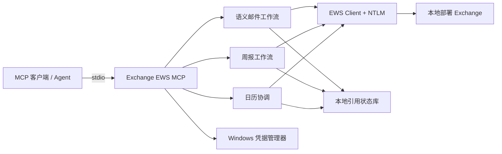

# Exchange EWS MCP v0.8.3

[English](README.md) | **简体中文**

[](https://github.com/ShermanGu/exchange-ews-mcp/actions/workflows/ci.yml)
[](https://www.python.org/)
[](https://www.microsoft.com/windows/)
[](LICENSE)

📮 **让你的本地 Exchange 多一个真正能干活的 AI 助手。**

还在为每周的**周报**发愁吗？还在邮箱里翻半天找上一封邮件？想约个会，还得一个个确认大家什么时候有空？

**Exchange EWS MCP** 通过 **EWS + NTLM** 把 MCP Agent 直接连接到公司 Exchange。搜索邮件、创建草稿、回复、更新周报、查询空闲时间、创建和修改会议，都可以直接交给 Agent；真正重要的发送操作仍然由用户确认。

> [!IMPORTANT]
> 本项目面向开放 **EWS + NTLM** 的本地部署 Exchange，不是 Exchange Online / Microsoft Graph 的 OAuth 客户端。

## ✨ 能做什么？

- 📧 搜索邮件、新建草稿、回复、转发、修改草稿、添加附件。
- 👥 使用姓名全拼或完整邮箱解析收件人，并处理重名情况。
- 📝 自动更新周报，同时尽量保留原来的 Outlook HTML 格式。
- 📅 查询忙闲、找多人共同时间、创建/修改会议、确认后发送邀请。
- 🔐 密码保存在 Windows 凭据管理器，不写进项目文件。
- 🛡️ 邮件草稿优先，最后的“发送”仍然由你决定。

## 🧭 架构



Server 在 Windows 本地运行，通过 EWS 访问 Exchange。Agent 面对的是邮件、周报和日历这些高层功能，不需要直接处理底层 Exchange ID。

---

# 🚀 快速开始

**克隆 → 安装 → 配置 Exchange → 在 MCP 客户端填一个 Server 路径。**

## 1. 环境要求

- Windows 10/11 或 Windows Server
- Python 3.10–3.13
- 本机可以访问公司的 Exchange EWS 地址
- Exchange 账号允许使用 EWS + NTLM

## 2. 安装

```powershell
git clone https://github.com/ShermanGu/exchange-ews-mcp.git
cd exchange-ews-mcp
.\install.cmd
```

`install.cmd` 会自动创建 `.venv` 并安装项目，不需要手动处理一长串依赖。

## 3. 配置 Exchange

运行配置向导：

```powershell
.\.venv\Scripts\exchange-ews-mcp.exe configure
```

设置当前邮箱用户：

```powershell
.\.venv\Scripts\exchange-ews-mcp.exe set-current-user `
  --email "you@company.example" `
  --display-name "你的姓名"
```

检查配置和连接：

```powershell
.\.venv\Scripts\exchange-ews-mcp.exe status
.\.venv\Scripts\exchange-ews-mcp.exe test
```

密码会保存到 **Windows 凭据管理器**，不会写进仓库。

## 4. 配置日历偏好

```powershell
.\.venv\Scripts\exchange-ews-mcp.exe set-calendar-preferences `
  --time-zone "Asia/Shanghai" `
  --workday-start "09:00" `
  --workday-end "18:00" `
  --slot-minutes 30
```

## 5. 接入 MCP 客户端

### ✅ 最推荐：直接使用 Server EXE

安装完成后，Production MCP Server 就在：

```text
<项目目录>\.venv\Scripts\exchange-ews-mcp-server.exe
```

如果你的 MCP 客户端有 **Command / 命令** 和 **Arguments / 参数** 输入框，直接填：

```text
Command / 命令：
D:\tools\exchange-ews-mcp\.venv\Scripts\exchange-ews-mcp-server.exe

Arguments / 参数：
留空
```

使用**绝对路径**，保存后重启 MCP 客户端即可。

### 或者使用 JSON

```json
{
  "mcpServers": {
    "exchange-ews": {
      "command": "D:\\tools\\exchange-ews-mcp\\.venv\\Scripts\\exchange-ews-mcp-server.exe"
    }
  }
}
```

也可以让 CLI 输出 MCP 配置信息：

```powershell
.\.venv\Scripts\exchange-ews-mcp.exe mcp-config
```

## 6. 最后检查一下

```powershell
.\.venv\Scripts\exchange-ews-mcp.exe version
.\.venv\Scripts\exchange-ews-mcp.exe tool-list
```

预期版本：`0.8.3` · Production 工具数量：`11`

🎉 到这里就完成了，可以直接让 Agent 开始干活。

## 💬 可以直接这样说

```text
找到我最新一封周报，根据我这周的进展帮我更新一下。
```

```text
给 wangxiaoming 写封邮件草稿，说联调已经完成，正式一点，别发送。
```

```text
找一下我和 lixiaohong 下周最早都有空的1小时，创建会议，只保存先别发。
```

## 🧰 主要功能

| 场景 | Agent 可以做什么 |
| --- | --- |
| 邮件 | 搜索/读取邮件、新建草稿、回复、转发、修改草稿、添加附件 |
| 人员 | 收件人解析、重名候选处理 |
| 周报 | 读取历史周报，自动选择 Reply All 或新建草稿，并保留原格式 |
| 日历 | 查询忙闲、找共同时间、读取日程、创建/修改会议、发送邀请 |

精简邮件门面使用 `search_mail`、`read_mail`、`resolve_people`、`save_mail_draft` 和 `edit_mail_draft`；周报只暴露 `weekly_report` 一个入口，第二步统一通过 `continue_action`；会议创建和修改统一使用 `save_meeting`，确认发送使用 `send_meeting_invitation`。

## 📝 周报流程

```text
找到上一封周报
      ↓
读取三周上下文（当前周 + 前两周）
      ↓
Agent 判断哪些地方发生变化
      ↓
只更新相关文字
      ↓
自动创建未发送的 Reply All 或新建草稿
```

Agent **不会重新生成整份 HTML**。原来的表格和格式由 Server 保留，只替换需要更新的文字。Agent 使用 `s1` 这类短局部槽位 ID；Server 会自动把可识别的 Subject 日期/周次顺延到下一周。

## 🔒 安全设计，简单说

- 邮件默认先生成草稿。
- 会议邀请发送前需要明确确认。
- 密码保存在 Windows 凭据管理器。
- 重名或多个会议时间会让用户确认，不会直接猜。

## 📚 更多文档

[Agent 接入](docs/AGENT-CONNECTION.md) · [Agent 工具](docs/AGENT-TOOLS.md) · [架构](docs/ARCHITECTURE.md) · [周报工作流](docs/WEEKLY-REPORT.md) · [真实 Exchange DT](docs/DT.md) · [版本记录](docs/CHANGELOG.md)

开发相关：[贡献指南](docs/CONTRIBUTING.zh-CN.md) · [安全说明](docs/SECURITY.zh-CN.md)

## 已知限制

主要运行平台是 Windows。实际 EWS 行为取决于 Exchange 版本和邮箱策略。周报编辑目前要求 EWS 返回可识别的 Outlook/Word HTML 回复结构。Exchange Online 通常更适合 Microsoft Graph + 现代身份认证。

## License

本项目使用 [MIT License](LICENSE)。
