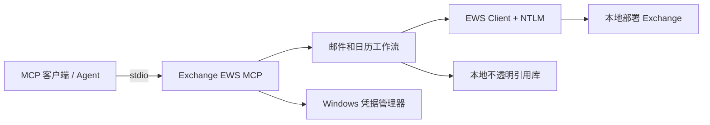

# Exchange EWS MCP

[English](README.md) | **简体中文**

[](https://github.com/ShermanGu/exchange-ews-mcp/actions/workflows/ci.yml)
[](https://www.python.org/)
[](https://www.microsoft.com/windows/)
[](LICENSE)

一个面向本地部署 Microsoft Exchange 的“草稿优先”[模型上下文协议（MCP）](https://modelcontextprotocol.io/)服务器。它通过 EWS + NTLM 连接 Exchange，把密码保存在 Windows 凭据管理器中，并通过 stdio 向 MCP 客户端提供聚焦的邮件与日历工具。

> [!IMPORTANT]
> 本项目面向开放 EWS + NTLM 的本地部署 Exchange 环境，不是 Exchange Online 或 Microsoft Graph 的 OAuth 客户端。

## 项目特点

- **完全本地运行**：MCP Server 运行在用户的 Windows 电脑上，不需要中转服务。
- **草稿优先**：写邮件、回复和转发工具只创建草稿，不自动发送。
- **会议发送需确认**：发送会议邀请必须经过显式确认。
- **工具职责清晰**：Production 配置提供 18 个身份、邮件、模板、忙闲和日历工具。
- **不透明本地引用**：Agent 使用 `message_ref`、`draft_ref`、`template_ref`，不直接处理 Exchange ItemId/ChangeKey。
- **会话感知模板**：优先使用 EWS `UniqueBody`，在保存模板前排除引用的历史邮件。
- **服务端模板渲染**：完整模板保留在本机；使用 `template_ref` 时，Agent 只提供新的正文片段。

## 安全边界

| 边界 | 行为 |
| --- | --- |
| 凭据 | 密码写入 Windows 凭据管理器，不进入项目文件或 MCP 返回值。 |
| 邮件写入 | 新建、回复和转发流程只创建未发送草稿。 |
| 会议邀请 | 发送邀请需要显式确认参数。 |
| Exchange 标识 | ItemId 和 ChangeKey 保留在有时效的本地引用之后。 |
| 搜索歧义 | 返回候选项和可恢复确认令牌，不擅自选择。 |
| 模板 HTML | 完整 HTML 留在本地状态库；超长工具结果只返回紧凑预览。 |
| 附件 | 限制可访问路径，并在创建草稿前完成模板资源预检。 |

这些边界用于降低风险，但不能替代 Exchange 权限、服务器策略、MCP 客户端控制以及用户审核。

## 架构



Production Server 只公开语义工作流；Debug Server 额外提供 6 个底层 EWS 写入原语，用于协议排查。

## 环境要求

- Windows 10/11 或 Windows Server
- Python 3.10 或更高版本
- 本机能够访问 Exchange EWS 地址
- Exchange 账号允许通过 NTLM 使用 EWS
- 支持本地 stdio Server 的 MCP 客户端

## 快速开始

### 1. 克隆并安装

```powershell
git clone https://github.com/ShermanGu/exchange-ews-mcp.git
cd exchange-ews-mcp
.\install.cmd
```

安装程序会创建 `.venv`、安装项目和依赖，并验证实际安装版本。

### 2. 配置 Exchange

```powershell
.\.venv\Scripts\exchange-ews-mcp.exe configure
.\.venv\Scripts\exchange-ews-mcp.exe set-current-user `
  --email "you@company.example" `
  --display-name "你的姓名"
.\.venv\Scripts\exchange-ews-mcp.exe status
.\.venv\Scripts\exchange-ews-mcp.exe test
```

`configure` 会提示输入 EWS URL、用户名和密码；密码保存到 Windows 凭据管理器。

### 3. 生成 MCP 配置

```powershell
.\.venv\Scripts\exchange-ews-mcp.exe mcp-config
```

等价配置：

```json
{
  "mcpServers": {
    "exchange-ews": {
      "command": "D:\\tools\\exchange-ews-mcp\\.venv\\Scripts\\python.exe",
      "args": ["-m", "exchange_ews_mcp.server"]
    }
  }
}
```

修改配置后请完整重启 MCP 客户端。日常使用 Production Server；只有排查协议问题时才使用 `exchange_ews_mcp.debug_server`。

### 4. 验证安装

```powershell
.\.venv\Scripts\exchange-ews-mcp.exe version
.\.venv\Scripts\exchange-ews-mcp.exe tool-list
```

## Production 工具

| 分类 | 工具 |
| --- | --- |
| 身份与邮件读取 | `get_current_user`、`list_emails`、`search_emails`、`get_email`、`find_email`、`resolve_people` |
| 草稿工作流 | `compose_email`、`extract_email_template`、`reply_to_email`、`forward_email`、`update_email_draft`、`add_attachment_to_draft`、`continue_action` |
| 日历 | `get_user_availability`、`list_calendar_events`、`get_calendar_item`、`find_meeting_times`、`schedule_meeting` |

工具路由规则见 [AGENT-TOOLS.md](AGENT-TOOLS.md)，MCP 客户端连接方法见 [AGENT-CONNECTION.md](AGENT-CONNECTION.md)。

## 模板工作流

模板提取是只读操作，与写新邮件或回复完全解耦：

```text
extract_email_template
        ↓ template_ref + 紧凑预览
Agent 只生成新的正文片段
        ↓
compose_email 或 reply_to_email
        ↓
服务器在本地完整模板中完成渲染
```

单一正文参数契约：

- 没有 `template_ref`：`body_html` 是完整 HTML。
- 有 `template_ref`：`body_html` 只是新的正文片段。
- 回复时，`message_ref` 决定会话和收件人，`template_ref` 独立决定格式资源。

示例：

```text
extract_email_template(...) -> template_ref
compose_email(..., template_ref=template_ref, body_html="<p>新的正文</p>")
reply_to_email(message_ref=target, template_ref=template_ref, body_html="<p>新的回复</p>")
```

模板中的普通附件默认不复制；最终 HTML 实际引用的 `cid:` 内联资源会在预检通过后复制。

## 开发与测试

```powershell
py -3 -m venv .venv
.\.venv\Scripts\python.exe -m pip install -e ".[test]"
.\.venv\Scripts\python.exe -m pytest -W error::ResourceWarning
```

当前回归测试共 185 项。GitHub Actions 会在支持的 Python 版本上运行严格测试。

## 文档

| 文档 | 用途 |
| --- | --- |
| [AGENT-CONNECTION.md](AGENT-CONNECTION.md) | 连接 MCP 客户端并选择 Production 配置。 |
| [AGENT-TOOLS.md](AGENT-TOOLS.md) | 工具清单和 Agent 路由说明。 |
| [ARCHITECTURE.md](ARCHITECTURE.md) | 邮件模板架构与安全属性。 |
| [TEMPLATE-EXTRACTION.md](TEMPLATE-EXTRACTION.md) | 模板提取、`UniqueBody`、引用和资源规则。 |
| [TEMPLATE-ARCHITECTURE.zh-CN.md](TEMPLATE-ARCHITECTURE.zh-CN.md) | 中文模板架构详解。 |
| [CHANGELOG.md](CHANGELOG.md) | 版本变更记录。 |
| [CONTRIBUTING.zh-CN.md](CONTRIBUTING.zh-CN.md) | 中文贡献指南。 |
| [SECURITY.zh-CN.md](SECURITY.zh-CN.md) | 中文安全报告策略。 |

## 已知限制

- 主要运行平台是 Windows，因为凭据存储依赖 Windows 凭据管理器，认证使用 NTLM。
- EWS 的行为和可用性取决于 Exchange 版本、服务器配置和管理员策略。
- 本项目不会绕过邮箱权限或组织安全控制。
- Exchange Online 通常应优先使用 Microsoft Graph 和现代身份认证。

## 参与贡献与安全报告

欢迎贡献。请阅读[中文贡献指南](CONTRIBUTING.zh-CN.md)或[英文贡献指南](CONTRIBUTING.md)。

请勿在公开 Issue 中披露安全漏洞。请按照 [SECURITY.zh-CN.md](SECURITY.zh-CN.md) 或 [SECURITY.md](SECURITY.md) 私下报告。

## 许可证

本项目使用 [MIT License](LICENSE)。
